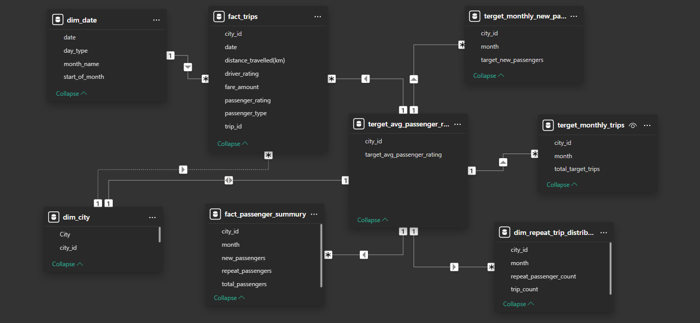

# ***📌 GoodCabs Performance Analysis & Dashboard***  

🚖 **Project:** Data Analysis & Dashboard for GoodCabs  
📊 **Tools Used:** SQL, Power BI, PostgreSQL  
🎯 **Objective:** Provide insights to the Chief of Operations at GoodCabs  

---

## **📍 Overview**  

This project is an in-depth analysis of **GoodCabs' operations**, focusing on:  
✔ **Trip volume & revenue trends**  
✔ **New vs repeat passenger behavior**  
✔ **City-wise performance & customer satisfaction**  
✔ **Target vs actual business performance**  

To achieve this, I:  
✅ **Designed a Power BI dashboard** for interactive reporting.  
✅ **Structured a PostgreSQL database** and imported data.  
✅ **Wrote SQL queries** to extract key insights.  
✅ **Created data models** to optimize Power BI relationships.  
✅ **Provided strategic recommendations** for business growth.  

---

### **📂 Data Setup & SQL Queries**  

## **1️⃣ Database Creation in PostgreSQL**  

### **Create the GoodCabs Database**  
```sql
CREATE DATABASE GoodCabs;
```

---

## **2️⃣ Creating Tables in PostgreSQL**  

### **`trips_db` (Operational Data)**
```sql
CREATE TABLE IF NOT EXISTS dim_city (
    city_id VARCHAR(10) PRIMARY KEY,
    city_name VARCHAR(50) NOT NULL
);

CREATE TABLE IF NOT EXISTS dim_date (
    date DATE PRIMARY KEY,
    start_of_month DATE NOT NULL,
    month_name VARCHAR(20) NOT NULL,
    day_type VARCHAR(10) CHECK (day_type IN ('Weekday', 'Weekend'))
);

CREATE TABLE IF NOT EXISTS fact_passenger_summary (
    month DATE NOT NULL,
    city_id VARCHAR(10) REFERENCES dim_city(city_id),
    total_passengers INT NOT NULL,
    new_passengers INT NOT NULL,
    repeat_passengers INT NOT NULL,
    PRIMARY KEY (month, city_id)
);

CREATE TABLE IF NOT EXISTS dim_repeat_trip_distribution (
    month DATE NOT NULL,
    city_id VARCHAR(10) REFERENCES dim_city(city_id),
    trip_count VARCHAR(10) NOT NULL,  
    repeat_passenger_count INT NOT NULL,
    PRIMARY KEY (month, city_id, trip_count)
);

CREATE TABLE IF NOT EXISTS fact_trips (
    trip_id SERIAL PRIMARY KEY,
    date DATE REFERENCES dim_date(date),
    city_id VARCHAR(10) REFERENCES dim_city(city_id),
    passenger_type VARCHAR(10) CHECK (passenger_type IN ('New', 'Repeat')),
    distance_travelled DECIMAL(5,2),
    fare_amount DECIMAL(10,2),
    passenger_rating DECIMAL(3,2) CHECK (passenger_rating BETWEEN 1 AND 10),
    driver_rating DECIMAL(3,2) CHECK (driver_rating BETWEEN 1 AND 10)
);
```

### **`targets_db` (Company Targets)**
```sql
CREATE TABLE IF NOT EXISTS city_target_passenger_rating (
    city_id VARCHAR(10) REFERENCES dim_city(city_id),
    target_avg_passenger_rating DECIMAL(3,2) CHECK (target_avg_passenger_rating BETWEEN 1 AND 10),
    PRIMARY KEY (city_id)
);

CREATE TABLE IF NOT EXISTS monthly_target_new_passengers (
    month DATE NOT NULL,
    city_id VARCHAR(10) REFERENCES dim_city(city_id),
    target_new_passengers INT NOT NULL,
    PRIMARY KEY (month, city_id)
);

CREATE TABLE IF NOT EXISTS monthly_target_trips (
    month DATE NOT NULL,
    city_id VARCHAR(10) REFERENCES dim_city(city_id),
    total_target_trips INT NOT NULL,
    PRIMARY KEY (month, city_id)
);
```

---

## **3️⃣ Importing CSV Data into PostgreSQL**  

Ensure CSV files are imported in the correct order:  

```sql
COPY dim_city FROM '/path/to/dim_city.csv' DELIMITER ',' CSV HEADER;
COPY dim_date FROM '/path/to/dim_date.csv' DELIMITER ',' CSV HEADER;
COPY city_target_passenger_rating FROM '/path/to/city_target_passenger_rating.csv' DELIMITER ',' CSV HEADER;
COPY monthly_target_new_passengers FROM '/path/to/monthly_target_new_passengers.csv' DELIMITER ',' CSV HEADER;
COPY monthly_target_trips FROM '/path/to/monthly_target_trips.csv' DELIMITER ',' CSV HEADER;
COPY fact_passenger_summary FROM '/path/to/fact_passenger_summary.csv' DELIMITER ',' CSV HEADER;
COPY dim_repeat_trip_distribution FROM '/path/to/dim_repeat_trip_distribution.csv' DELIMITER ',' CSV HEADER;
COPY fact_trips FROM '/path/to/fact_trips.csv' DELIMITER ',' CSV HEADER;
```

---
# **📊 Power BI Dashboard Overview**
The Power BI dashboard provides an interactive and self-explanatory view of GoodCabs' performance.


## **📊   Data Modeling**  

## **📌 Data Model Overview**  

  

✔ **Star Schema** ensures optimized relationships.  
✔ **Fact tables (transactions)**: `fact_trips`, `fact_passenger_summary`  
✔ **Dimension tables (lookup values)**: `dim_city`, `dim_date`, `dim_repeat_trip_distribution`  
✔ **Target tables (company goals)**: `monthly_target_trips`, `city_target_passenger_rating`  

---

## **📂 Dashboard Creation Process**  

### **1️⃣ Data Cleaning & Preprocessing**  
✔ Filtered missing or inconsistent data.  
✔ Converted date formats to ensure **time-based analysis**.  

### **📌 Key Features of the Dashboard:**  
- 🚀 **KPI Cards:** Track key performance metrics like total trips, revenue, passenger ratings.  
- 📈 **City-Wise Performance:** Compare revenue, trip volume, and customer satisfaction.  
- 🔄 **New vs Repeat Passengers:** Analyze retention trends and their revenue impact.  
- 📊 **Trip Volume Trends:** Understand how demand changes over time.  
- 🔥 **Repeat Passenger Analysis:** Identify trip frequency patterns for returning customers.  
- 🏆 **Target vs Actual Metrics:** Assess performance against company goals.  
- 🔍 **Filters & Drilldowns:** Users can filter by **City, Month, and Passenger Type**.  

### **📂 Dashboard Structure**  
- **Page 1:** Overview with KPIs and key trends.  

- **Page 2:** City-wise analysis (revenue, ratings, and performance).  

- **Page 3:** Repeat customer behavior insights.  

- **Page 4:** Reccomendations (benchmarking performance).  


# **📌 Key Insights & Recommendations**  

### **🚖 1. Repeat Customers Generate More Revenue, but Retention is Low**  
✔ Repeat passengers **spend more per trip**, but retention is weak.  
✔ **Solution:** Launch **loyalty programs** and **targeted offers**.  

### **💰 2. Jaipur is the Most Profitable City**  
✔ Jaipur’s revenue **far exceeds** other cities.  
✔ **Solution:** Expand Jaipur’s strategies to **underperforming cities**.  

### **⭐ 3. Repeat Customers Give Lower Ratings**  
✔ **New passengers** rate trips higher than returning customers.  
✔ **Solution:** Improve **service quality & driver training**.  

### **📉 4. Declining Trip Trends**  
✔ **Solution:** Introduce **discounts & referral programs** to boost rides.  

---

# **🔧 Challenges & Learnings**  

📌 **Foreign Key Constraint Issues in PostgreSQL**  
✔ Resolved by **importing tables in the correct order**.  

📌 **Displaying City Names Above Bars in Power BI**  
✔ Used **custom DAX measures** to format visuals.  

📌 **Comparing Targets vs. Actuals in Power BI**  
✔ Implemented **DAX formulas** for benchmarking performance.  

---

# **📂 Project Files**  

📊 **Live Dashboard Link -https://shorturl.at/KKjrs

📁 **GitHub Link - https://github.com/Subhrajyouti/GoodCabs-Analytics** → All SQL scripts  


---

# **🚀 Conclusion & Next Steps**  

📌 **Key Takeaways:**  
✔ Repeat customers drive revenue, but retention is low.  
✔ Jaipur is outperforming other cities—replicate its success.  
✔ Customer satisfaction needs improvement for repeat users.  
✔ Declining trip trends require new marketing strategies.  

🚀 **Next Steps:**  
✔ Expand dashboard with **predictive analytics**.  
✔ Automate reporting with **scheduled SQL queries**.  
✔ Monitor impact of **new retention strategies**.  

🔗 **[Insert Final Dashboard Screenshot Here]**  

---
